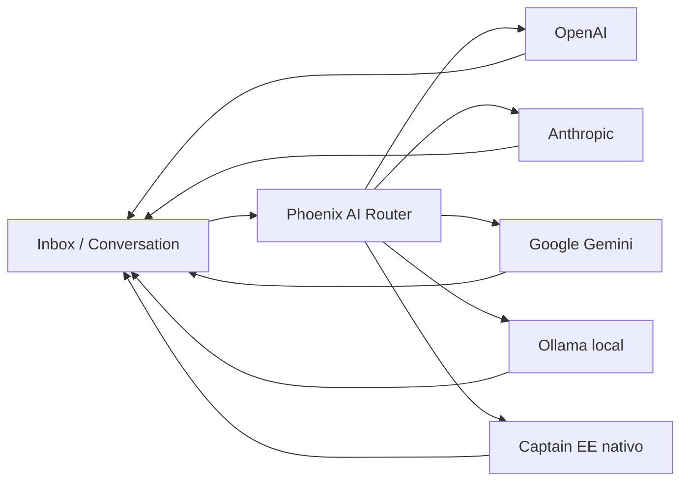

# Arquitetura IA — Phoenix Digital Omnichannel (Fase 8)

**Escopo:** pontos de integração futuros — **sem implementação** de modelos nesta fase.

---

## 1. Pontos nativos no Chatwoot 4.14.1

| Área | Caminho | Função |
|------|---------|--------|
| **Captain** (EE) | `app/controllers/api/v1/accounts/captain/*` | Assistentes, documentos, copilot, rewrite, summarize |
| **Agent Bots** | `AgentBot` + webhook URL | Bot externo por inbox |
| **OpenAI (legado)** | Integrations → OpenAI (se habilitado) | Sugestões, labeling |
| **Prosemirror / editor** | `@chatwoot/prosemirror-schema` | UI apenas |

Tarefas Captain expostas em rotas:

- `POST .../captain/tasks/rewrite`  
- `POST .../captain/tasks/summarize`  
- `POST .../captain/tasks/reply_suggestion`  
- `POST .../captain/tasks/label_suggestion`  

---

## 2. Onde plugar provedores externos

### OpenAI

| Hook | Estratégia futura |
|------|-------------------|
| Captain backend | Adapter `Phoenix::Ai::OpenAiProvider` chamado por services Captain |
| Agent Bot | Proxy webhook → OpenAI Assistants API |
| ENV legado AGENTE | `OPENAI_API_KEY`, `OPENAI_MODEL` em `.env.example` (API separada) |

### Anthropic (Claude)

| Hook | Estratégia |
|------|------------|
| Reply suggestion | Provider switch em `InstallationConfig` → `AI_PROVIDER=anthropic` |
| ENV | `ANTHROPIC_API_KEY`, `ANTHROPIC_MODEL` (já no `.env.example` raiz) |

### Google Gemini

| Hook | Estratégia |
|------|------------|
| Novo initializer | `config/initializers/phoenix_ai.rb` registrando provider |
| UI | Settings → Integrations (sem alterar models) |

### Ollama (local)

| Hook | Estratégia |
|------|------------|
| Self-hosted | `OLLAMA_BASE_URL`, `OLLAMA_MODEL` — ideal para Mac mini / air-gap |
| Bridge | Sidekiq job `Phoenix::Ai::OllamaCompletionJob` consumindo fila `medium` |

---

## 3. Diagrama de fluxo (futuro)

---

## 4. Arquivos candidatos (quando implementar)

| Ação | Local sugerido |
|------|----------------|
| Novo código Phoenix | `app/services/phoenix/ai/` |
| Config | `installation_config.yml` chaves `PHOENIX_AI_PROVIDER`, `PHOENIX_AI_FALLBACK` |
| Sem alterar | `app/models/message.rb`, migrations |
| Observabilidade | Logs JSON `phoenix.ai.completion` (padrão webhook Meta) |

---

## 5. Compliance e limites

- Não enviar PII para modelos cloud sem DPA  
- Rate limit por Account (Redis)  
- Human handoff: usar `assignee_id` + label `bot_handoff` (automação existente)  

---

*Fase 8 concluída em modo documentação.*
